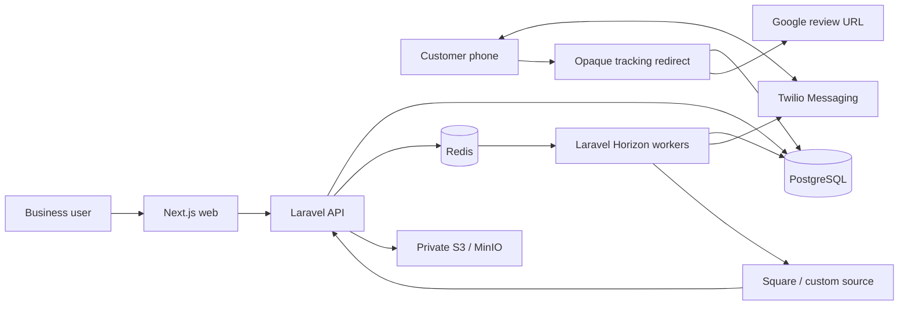

# Architecture

## System view



## Modular monolith

Laravel modules are Identity, Tenancy, Locations, Customers, Consent, Visits, Integrations, Automations, Templates, Messaging, Media, Tracking, Analytics, and Audit. Modules share one database and deployable runtime but communicate through explicit actions, DTOs, events, and jobs. External provider shapes terminate in Integrations.

## Request and tenancy flow

Next.js obtains a Sanctum CSRF cookie and uses same-site secure session cookies. Middleware resolves authenticated memberships; an explicit active-business selection must match a membership. Controllers use tenant-scoped binding, form requests, policies, domain actions, and API resources. Platform elevation is separately authorized and audited.

## Queue flow

Redis queues are `default`, `webhooks`, `integrations`, `messaging`, `media`, and `analytics`. Jobs carry stable identifiers rather than serialized PII, re-fetch scoped models, enforce idempotency, use bounded exponential retries, and expose terminal failures to authorized operators.

## Webhook and messaging flow

```mermaid
sequenceDiagram
  participant Provider
  participant API
  participant DB
  participant Worker
  participant Messaging
  Provider->>API: signed raw webhook
  API->>API: verify signature
  API->>DB: insert unique event
  API-->>Provider: 2xx acknowledgement
  API->>Worker: dispatch event id
  Worker->>Provider: fetch current resource if required
  Worker->>DB: upsert customer + visit; record decision
  Worker->>Worker: evaluate consent/suppression/rules
  Worker->>DB: create scheduled message + tracking link
  Worker->>Messaging: send SMS/MMS
  Messaging-->>API: status callback
  API->>DB: append event and update status
```

## Tracking flow

`GET /r/{random-token}` validates active/expiry state, transactionally records minimal click metadata and counters, then returns an HTTP 302 to a validated HTTPS destination. Tokens contain no PII. Clicking cancels configured unsent follow-ups, but is never called a submitted review.

## Deployment

Local Compose separates web, PHP-FPM, Nginx, PostgreSQL, Redis, worker, Horizon, scheduler, MinIO, and Mailpit. Production may consolidate identical application images while retaining independently scalable web and worker processes. Stateless application containers use managed PostgreSQL/Redis/object storage, TLS ingress, centralized logs, metrics, backups, and rolling migrations.
