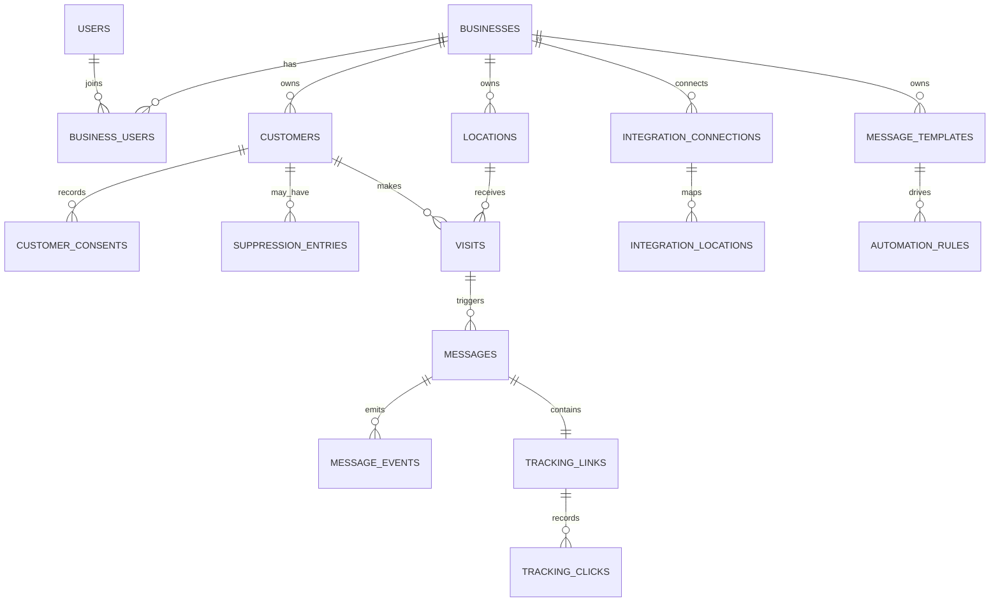

# Data Model

## Tenancy and relationships

All domain IDs are ULIDs. `businesses` own locations, customers, consent/suppression, visits, templates, rules, messages, tracking, media, connections, and audits. Users join businesses through `business_users`; platform roles are independent. Provider identities are unique within `(business_id, provider, external_id)`.

## Important constraints and indexes

- Unique membership `(business_id, user_id)` and business slug.
- Unique provider webhook `(provider, external_event_id)`.
- Unique external customer identity `(business_id, provider, external_customer_id)`.
- Tenant-scoped customer phone hash when present; retain safe merge/conflict handling.
- Unique visit identities per business/source/external identifier and unique automation dispatch per visit/rule/sequence.
- Unique provider message ID when present; unique tracking token hash.
- Leading `business_id` indexes on common status/date/location filters.
- Foreign keys explicitly restrict, cascade, or null according to retention requirements.

## Flexible data

JSONB is limited to encrypted/provider configuration, raw provider metadata, consent evidence, brand/text configuration, minimized event payloads, and audit before/after values. Frequently filtered data uses typed columns.

## Retention

Webhook payloads default to 30 days after successful processing and longer for unresolved failures with PII minimization. Tracking request metadata defaults to 90 days; aggregate counters remain. Generated personalized media expires by policy (default 30 days). Message/audit/consent evidence retention is configurable and deletion/anonymization jobs preserve required non-PII operational aggregates.

## Implemented foundation

The implemented foundation includes `businesses`, `business_users`, `platform_user_roles`, `locations`, `business_invitations`, `customers`, `customer_external_identities`, `customer_consents`, `suppression_entries`, `message_templates`, `media_templates`, `media_assets`, `generated_media`, `visits`, `square_appointments`, `automation_rules`, `automation_follow_ups`, `automation_dispatches`, `messaging_configurations`, `message_deliveries`, `review_links`, `integration_api_keys`, `idempotency_records`, `pos_integrations`, `square_oauth_states`, `admin_support_sessions`, and `audit_logs`. Customer phone numbers are normalized to E.164 and paired with a business-scoped unique SHA-256 lookup hash. Consent is append-only evidence rather than a boolean on the customer. Suppression is a separate lifecycle record so it can override consent without destroying its history. Automation dispatches are durable decisions and each dispatch can own at most one outbound delivery. MMS deliveries may reference one recipient-specific `generated_media` row; its retrieval capability is stored only as a SHA-256 token hash, while the background and rendered file remain on private storage.

Onboarding progress is stored on the business because it governs tenant readiness rather than an individual user's tour state. POS connection records contain status, non-secret configuration, and server-encrypted Square OAuth access/refresh tokens that are hidden from serialization. Generic credentials remain in the dedicated hashed/encrypted key table. Square OAuth states are stored only as hashes, expire after ten minutes, and are single-use. `square_appointments` contains the normalized scheduling projection and is deliberately separate from `visits`: an appointment cannot imply service completion or trigger messaging. Admin support sessions store only a token hash, expire after one hour, are bound to one administrator and one business, and create audit entries before tenant access is granted.

Customer-account provisioning stores searchable business identity and contact fields in typed `businesses` columns, creates the owner membership, and creates a primary `locations` record in one transaction. Structured street address data remains in the location address object because address formats vary by country. Internal platform setup notes are hidden from normal business serialization.

Plan entitlements are resolved server-side from the business `plan_code`; the UI is not trusted to enforce allowances. Basic includes one location, one review destination chosen from Google/Trustpilot/Facebook/Yelp/custom, five active message templates, and one personalized-media template. Growth includes five locations/destinations/templates/media items, and Pro includes fifteen of each. `location_review_destinations` is tenant-owned and unique by location/provider. The legacy location Google URL remains synchronized when Google is selected while messaging uses the provider-neutral destination relation.

Stripe billing keeps card data outside ReviewOrbit. `platform_stripe_settings` contains encrypted platform credentials and the hosted-portal configuration reference. `business_subscriptions` maps exactly one tenant to its Stripe customer/subscription and current lifecycle dates. `billing_invoices` is tenant-owned display metadata for hosted invoices. Verified events are unique by Stripe event ID in `stripe_webhook_events`. Plan products and immutable monthly/annual price IDs live on `subscription_plans`; archived plans remain resolvable for existing customers but are excluded from new checkout choices.

Toast partner state is separated by responsibility. `platform_toast_settings` stores encrypted environment credentials and per-subscription signing secrets. `toast_connection_requests` stores hashed/encrypted, expiring per-location mapping codes. `toast_restaurant_connections` maps a Toast restaurant GUID to exactly one tenant location per environment. `integration_webhook_events` is the durable verified intake log and is the only Toast table where `business_id` may initially be null, because a signed partner event is persisted before its connection code is resolved. Events are unique by `(provider, external_event_id)`.
